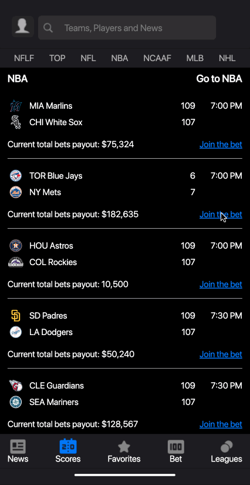

# Industry Challenge by [theScore](https://www.thescore.com/)  🏅 

**Challenge**: To build a solution within 24 hours that will increase the user engagement on the mobile app.

**Solution**:  Working as a team of Software Engineers, UX designers and Data Scientists, we have developed a user-friendly educational onboarding process with a simulation component.



## Installation

1. Clone this repo

2. Start the front-end of the project with npm

```bash
$ npm install
$ npm start
```

The front-end runs on http://localhost:3000/

Note: The application was specifically developed for Mobile Viewpoint.
## Tech Stack

**Client:** React, SASS, JavaScript


## Figma Design

[Click here](https://www.figma.com/file/9pNarftWP27W97Xsrsz9NU/Hackathon?type=design&node-id=2-676&t=kkIOjGYkaq3AMGi1-0) to view the design created by the UX Designers
## Presentation Deck

[Click here](https://drive.google.com/file/d/19pSa8fPn1JO_k2hww7VwXH7r2Upr2nQy/view?usp=sharing) to view the presentation deck that we delivered to the panel of judges from theScore
